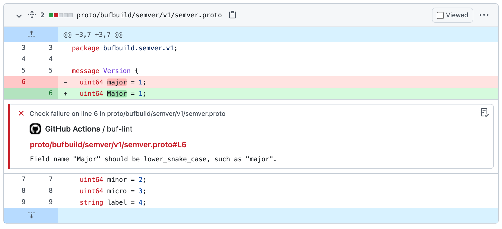

# buf-lint-action

Lint Protobuf files with [buf](https://github.com/bufbuild/buf), and
comment in-line on pull requests.

  

## Usage

Refer to the [action.yml](https://github.com/bufbuild/buf-lint-action/blob/main/action.yml)
to see all of the action parameters.

The `buf-lint` action requires that `buf` is installed in the Github Action
runner, so we'll use the [buf-setup][1] action to install it.

### Basic

In most cases, all you'll need to do is configure [buf-setup][1] to setup the `buf`
binary for your action.

```yaml
steps:
  - uses: actions/checkout@v2
  - uses: bufbuild/buf-setup-action@v0.5.0
  - uses: bufbuild/buf-lint-action@v1
```

### Inputs

Some repositories are structured so that their `buf.yaml` is defined
in a sub-directory alongside their Protobuf sources, such as a `proto/`
directory. In this case, you can specify the relative `input` path.

```sh
$ tree
.
└── proto
    ├── acme
    │   └── weather
    │       └── v1
    │           └── weather.proto
    └── buf.yaml
```

```yaml
steps:
  - uses: actions/checkout@v2
  - uses: bufbuild/buf-setup-action@v0.5.0
  - uses: bufbuild/buf-lint-action@v1
    with:
      input: 'proto'
```

The `buf-lint` action is also commonly used alongside other `buf` actions,
such as [buf-breaking][2] and [buf-push][3].

  [1]: https://github.com/marketplace/actions/buf-setup
  [2]: https://github.com/marketplace/actions/buf-breaking
  [3]: https://github.com/marketplace/actions/buf-push
